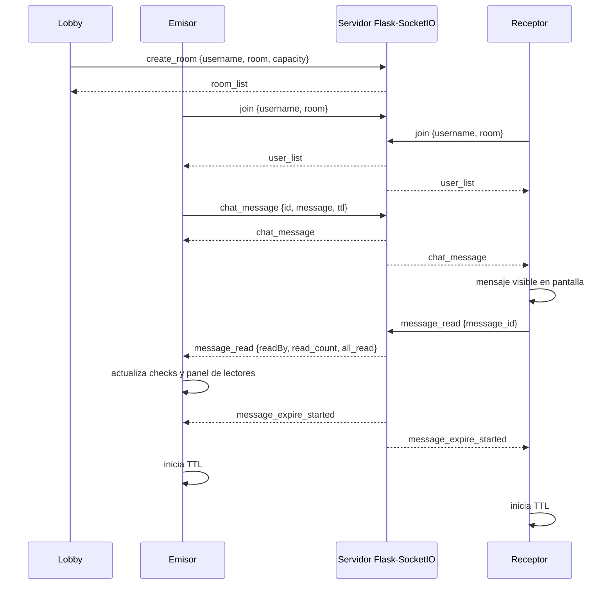
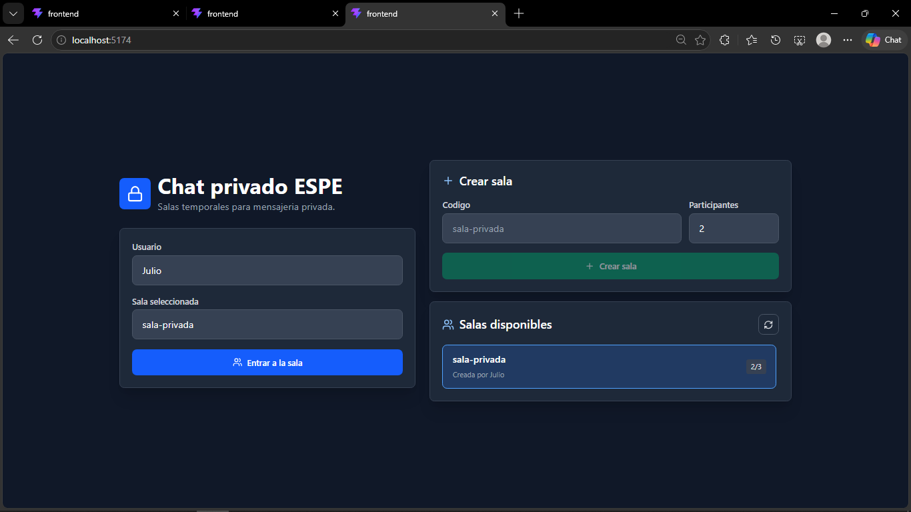
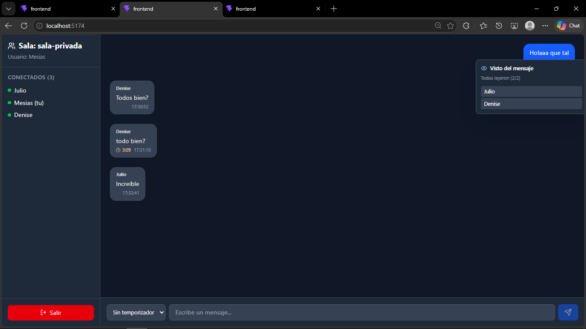

# Sistema de Mensajería Privada en Tiempo Real

**Integrantes:** Mesias Mariscal, Denise Rea, Julio Viche  
**Fecha:** 6 de mayo de 2026  
**Materia:** Aplicaciones Distribuidas - Laboratorio 2  
**Profesor:** Geovanny Cudco

## Descripción de Funcionalidades Implementadas

Aplicación de chat privado en tiempo real construida con **Flask-SocketIO** en el backend y **React + TypeScript + Tailwind CSS** en el frontend.

1. **Lobby de salas:** la pantalla principal permite crear una sala con cupo maximo de participantes y muestra las salas disponibles para entrar con un clic.
2. **Ingreso privado:** el usuario debe escribir un seudonimo y elegir una sala antes de entrar al chat.
3. **Salas aisladas:** los mensajes y eventos se retransmiten solo a clientes conectados en la misma sala.
4. **Confirmación de lectura:** cuando un receptor visualiza un mensaje en pantalla, el cliente emite `message_read`. El servidor reenvía esa confirmación únicamente al emisor original.
5. **Indicadores de visto:** los mensajes propios muestran check simple, doble check cuando alguien leyó y un contador `N/M`. Con clic derecho sobre un mensaje propio se abre el detalle de quién lo leyó.
6. **Mensajes temporales:** cada mensaje puede enviarse sin temporizador, con 10 segundos, 1 minuto o 5 minutos. La cuenta regresiva empieza cuando todos los receptores del mensaje ya lo leyeron.
7. **Sin persistencia de mensajes:** el servidor no guarda contenido en disco, archivos ni base de datos. Solo mantiene metadatos volátiles de sesiones activas y lecturas.
8. **Interfaz mínima:** lobby, vista de chat, burbujas con remitente, hora, temporizador, confirmaciones de lectura y lista de usuarios conectados.

## Instrucciones para Ejecutar

### Prerrequisitos

- Python 3.8+
- Node.js 18+
- npm

### Backend Flask

Navegar a la carpeta `server`:

```bash
cd server
python -m venv venv
venv\Scripts\activate
pip install -r requirements.txt
python app.py
```

El servidor queda disponible en:

```text
http://127.0.0.1:5000/
```

### Frontend React

Para facilitar la ejecución local, puedes correr el servidor de desarrollo de React. Este ya está configurado para conectarse automáticamente al backend en el puerto 5000:

```bash
cd frontend
npm install
npm run dev
```

Luego abre la dirección que te indique Vite (usualmente `http://localhost:5173/`) en dos navegadores o en una ventana normal y otra de incógnito. Crea una sala desde la pantalla principal, elige el cupo máximo y entra con usuarios distintos seleccionando esa sala desde la lista.

## Explicación Técnica

### Confirmaciones de Lectura

1. El cliente recibe `chat_message` y renderiza la burbuja.
2. Un `IntersectionObserver` detecta si el mensaje recibido está visible en pantalla.
3. Si el mensaje no fue enviado por el usuario actual, el cliente emite:

```text
message_read { message_id }
```

4. El servidor valida que el lector pertenezca a la misma sala y que sea destinatario del mensaje.
5. El servidor consulta sus metadatos en memoria y emite `message_read` solo al `sender_sid` original.
6. El emisor actualiza `readBy`, `read_count`, `recipient_count` y `all_read`.

### Creacion y Listado de Salas

- El lobby mantiene una conexion SocketIO ligera para recibir `room_list`.
- El evento `create_room` registra en memoria el codigo de sala, el creador y el cupo maximo.
- El servidor emite `room_list` cada vez que se crea una sala, entra un usuario o sale un usuario.
- El evento `join` valida que la sala exista, que no este llena y que el nombre no este repetido en la sala.
- La configuracion de salas vive solo en memoria y desaparece al reiniciar el servidor.

### Mensajes Temporales

- El emisor puede seleccionar TTL de `10`, `60` o `300` segundos.
- El servidor valida el TTL y lo reenvía junto al mensaje, pero no guarda el contenido.
- Cada receptor emite `message_read` cuando el mensaje entra en pantalla.
- Cuando todos los receptores conectados al momento del envio ya leyeron el mensaje, el servidor emite `message_expire_started` a la sala.
- Todos los clientes inician el temporizador al recibir `message_expire_started`.
- Cuando el contador llega a cero, React elimina el mensaje del estado local y desaparece de la interfaz.
- El servidor limpia los metadatos temporales después del TTL o cuando la sala queda vacía.

## Diagrama de Eventos SocketIO



## Capturas o Diagramas

### Lobby / Crear y Unirse a Salas


### Interfaz de Chat


## Validación del Enunciado

- `message_read` se emite cuando el receptor visualiza el mensaje.
- La confirmación de lectura se retransmite únicamente al emisor original.
- El emisor ve doble check y detalle de lectores.
- Los TTL disponibles son 10 segundos, 1 minuto y 5 minutos.
- La autodestruccion inicia cuando todos los receptores leyeron el mensaje.
- Los mensajes temporales desaparecen del cliente al finalizar la cuenta regresiva.
- No existe historial de mensajes en servidor ni persistencia en base de datos.
- El ingreso exige seudonimo y sala privada.
- La pantalla principal permite crear salas con cupo y listar salas disponibles.
- Los mensajes se retransmiten solo dentro de la sala.
- La UI muestra ingreso, chat, burbujas, hora, temporizador y usuarios conectados.
